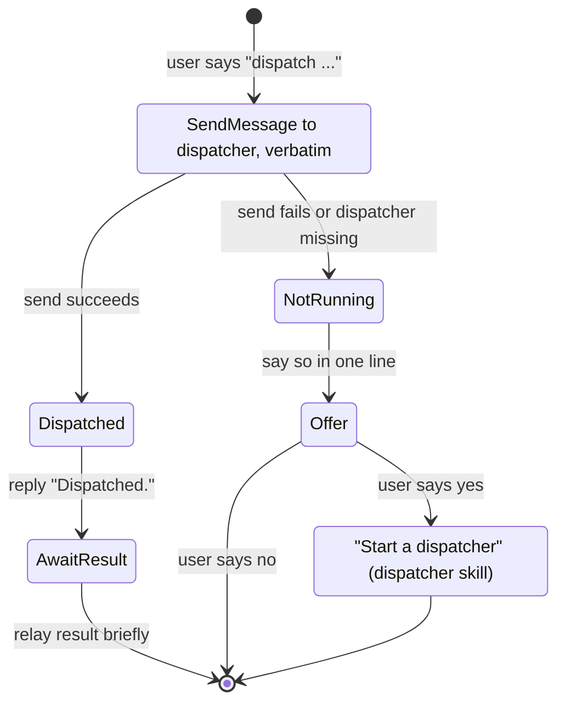

# dispatch

Sends a task verbatim to the long-running "dispatcher" session so this session stays free.

## Workflow

```mermaid
stateDiagram-v2
    [*] --> Send: user says "dispatch ..."
    Send --> Dispatched: send succeeds
    Send --> NotRunning: send fails or dispatcher missing
    Send: SendMessage to dispatcher, verbatim
    Dispatched --> AwaitResult: reply "Dispatched."
    AwaitResult --> [*]: relay result briefly
    NotRunning --> Offer: say so in one line
    Offer --> StartDispatcher: user says yes
    Offer --> [*]: user says no
    StartDispatcher --> [*]
    StartDispatcher: "Start a dispatcher" (dispatcher skill)
```
