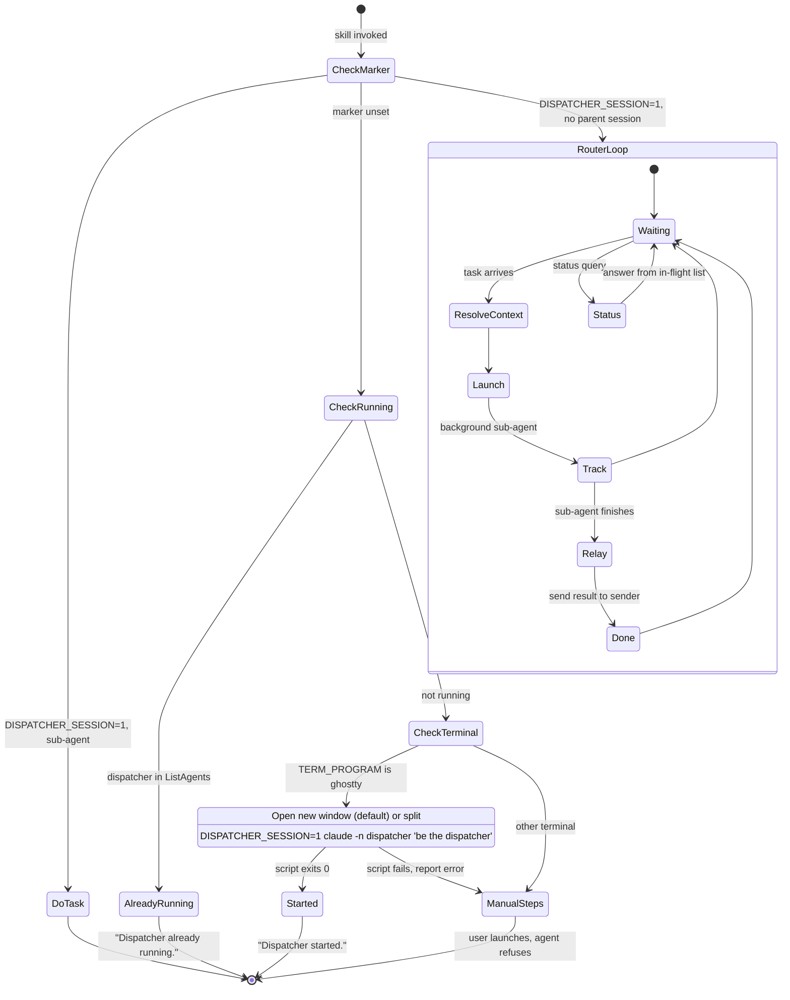

# dispatcher

Starts "dispatcher", a long-lived router session that hands every task to a background sub-agent in its own git worktree.

## Workflow

```mermaid
stateDiagram-v2
    [*] --> CheckMarker: skill invoked
    CheckMarker --> RouterLoop: DISPATCHER_SESSION=1, no parent session
    CheckMarker --> DoTask: DISPATCHER_SESSION=1, sub-agent
    CheckMarker --> CheckRunning: marker unset
    DoTask --> [*]

    CheckRunning --> AlreadyRunning: dispatcher in ListAgents
    CheckRunning --> CheckTerminal: not running
    AlreadyRunning --> [*]: "Dispatcher already running."

    CheckTerminal --> GhosttyOpen: TERM_PROGRAM is ghostty
    CheckTerminal --> ManualSteps: other terminal
    GhosttyOpen --> Started: script exits 0
    GhosttyOpen --> ManualSteps: script fails, report error
    Started --> [*]: "Dispatcher started."
    ManualSteps --> [*]: user launches, agent refuses

    GhosttyOpen: Open new window (default) or split
    GhosttyOpen: DISPATCHER_SESSION=1 claude -n dispatcher 'be the dispatcher'

    state RouterLoop {
        [*] --> Waiting
        Waiting --> ResolveContext: task arrives
        Waiting --> Status: status query
        Status --> Waiting: answer from in-flight list
        ResolveContext --> Launch
        Launch --> Track: background sub-agent
        Track --> Waiting
        Track --> Relay: sub-agent finishes
        Relay --> Done: send result to sender
        Done --> Waiting
    }
```
